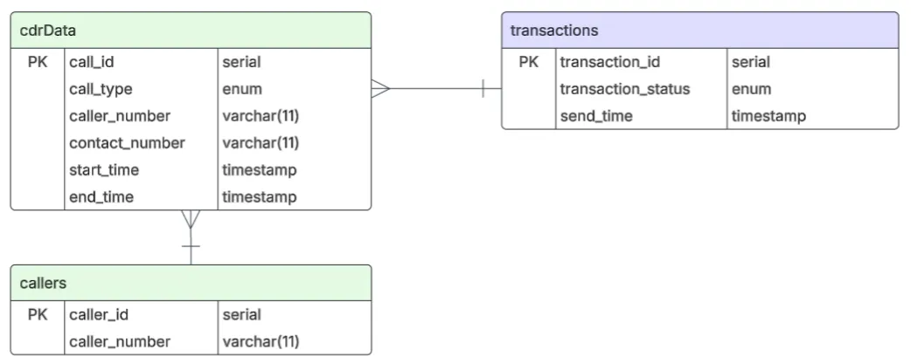

## Документация

### Структура приложения 

Проект разделен на следующие модули (микросервисы):
1. **cdr-generator**
- Генерация событий звонков
- Сбор CDR в файлы (txt/csv)
- Отправка CDR через RabbitMQ
2. **brt-service**
- Прием и хранение CDR записи
- Взаимодействие с HRS для расчета списаний
- Изменение баланса абонентов
3. **hrs-service**
- Хранение тарифов
- Расчет стоимости звонков
- Отправка результатов обратно в BRT 
3. **crm-service**
- REST API для ролей MANAGER и SUBSCRIBER
- Пополнение баланса, смена тарифа, регистрация абонента
- Интеграция с BRT и HRS через REST

Swagger от аналитиков: 

### Схема взаимодействия сервисов
.png)

Очереди RabbitMQ:
1. Между CDR и BRT:
    - cdr.queue: для передачи CDR-записей
2. Между BRT и HRS:
    - brt-to-hrs.queue: для отправки запросов на расчет стоимости звонков
    - hrs-to-brt.queue: для получения результатов расчета
    - monthly-fee-brt-to-hrs.queue: для запросов на расчет абонентской платы
    - monthly-fee-hrs-to-brt.queue: для получения результатов расчета абонентской платы
3. Между CRM и другими сервисами:
    - crm-to-brt.queue: для отправки запросов в BRT
    - brt-to-crm.queue: для получения ответов от BRT
    - crm-to-hrs.queue: для отправки запросов в HRS
    - hrs-to-crm.queue: для получения ответов от HRS

### CDR-модуль
#### Схема базы данных

#### Особенности реализации
- При запуске генерируются звонки. Предусмотрен механизм, который позволяет многопоточно создавать звонки в течение года. 
Учитывается, что одновременно абонент разговаривает только по 1 линии, но звонки разных пар абонентов могут накладываться.
- После того, как звонки были сгенерированы и записаны в базу данных, формируются CDR-файлы и отправляются в BRT-модуль.
- Реализован механизм модельного времени: реальное время ускоряется в TIME_COEFFICIENT раз. Отправка файлов осуществляется по вычисленной задержкой.
#### Ручной запуск
1. Запустить RabbitMQ:
```bash
docker-compose up -d rabbitmq
```
2. Запустить приложение:
```bash
./gradlew :cdr:bootRun
```

### BRT-модуль
#### Схема базы данных

#### Особенности реализации
- Данный модуль принимает CDR-файлы и синхронизирует модельное время
- Раз в день проверяются все абоненты оператора "Ромашка" на необходимость платить абонентскую плату
- От HRS получает величину ресурсов
- Использует PostgreSQL
- Поддерживает пакетную обработку данных (batch processing)
#### Ручной запуск
1. Запустить RabbitMQ и PostgreSQL:
```bash
docker-compose up -d rabbitmq postgres-brt
```
2. Запустить приложение:
```bash
./gradlew :brt:bootRun
```

### HRS-модуль
#### Схема базы данных
.png)
#### Особенности реализации
- По сути является калькулятором
- От BRT получает продолжительность звонка и ресурсы, которые есть у абонента
- Использует PostgreSQL
- Поддерживает пакетную обработку данных
#### Ручной запуск
1. Запустить RabbitMQ и PostgreSQL:
```bash
docker-compose up -d rabbitmq postgres-hrs
```
2. Запустить приложение:
```bash
./gradlew :hrs:bootRun
```

### CRM-модуль
#### Схема базы данных
Состоит из единственной таблицы `users`:
- id BIGSERIAL PRIMARY KEY
- username VARCHAR(100) 
- password VARCHAR(255): хранит bcrypt-хэш
- full_name VARCHAR(255)
- role VARCHAR(50): SUBSCRIBER или MANAGER
#### Особенности реализации
- Для авторизации используется JwtToken
#### Данные для авторизации
- логин: manager
- пароль: maneger
#### Ручной запуск
1. Запустить RabbitMQ:
```bash
docker-compose up -d rabbitmq
```
2. Запустить приложение:
```bash
./gradlew :crm:bootRun
```